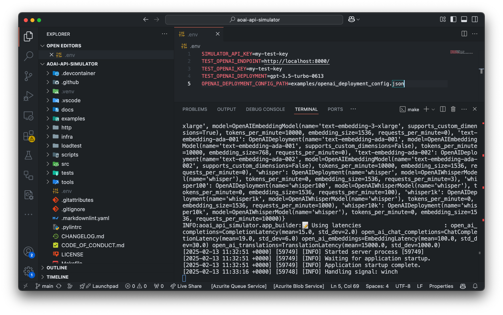
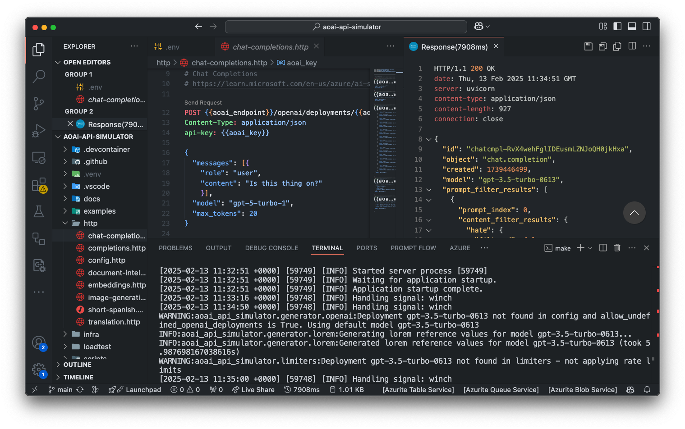
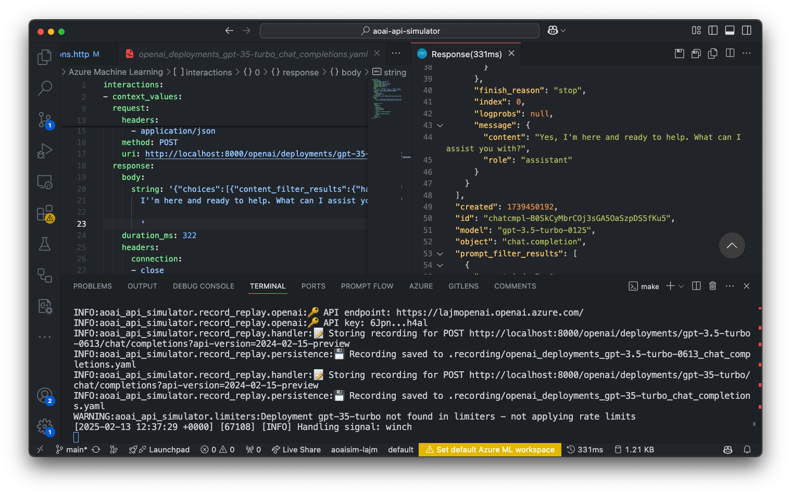

# Taking `aoai-api-simulator` to Kubernetes

By the end of this short lab, you will have a working understanding of the `aoai-api-simulator` and how to deploy it to a Kubernetes cluster.

The lab is non-prescriptive. You will be given a set of tasks to complete and some resources to help you, but you are encouraged to explore and experiment with the `aoai-api-simulator` as you see fit.

## Prerequisites

The lab requires the following tools to be installed on your machine. Alternatively, you can use [GitHub Codespaces](https://github.com/features/codespaces).

- [Git](https://git-scm.com/downloads)
- [Docker](https://www.docker.com/get-started/)
- [VS Code](https://code.visualstudio.com/Download)
- [VS Code Dev Cotnainers](https://marketplace.visualstudio.com/items?itemName=ms-vscode-remote.remote-containers)
- [Azure Subscription](https://azure.microsoft.com/free)
- *(Optional)* [Azure OpenAI Service resource](https://learn.microsoft.com/en-us/azure/ai-services/openai/how-to/create-resource)

## Tasks

### 1. Run the `aoai-api-simulator` locally

**Objective:** Clone the `aoai-api-simulator` repository and run the simulator locally. 



**Resources:**

1. The repository can be cloned using Git:

    ```console
    git clone https://github.com/microsoft/aoai-api-simulator.git
    ```

1. See [Getting Started](../running-deploying.md#getting-started) and [Running the Simulator Locally](../running-deploying.md#running-the-simulator-locally).

### 2. Send sample HTTP requests to the simulator.

**Objective:** Send some HTTP requests to the simulator and verify `200` responses with some generated completions.



**Resources:**

1. Use a tool like [REST Client](https://marketplace.visualstudio.com/items?itemName=humao.rest-client) or `curl` to send HTTP requests to the simulator.

    > **Note:** The project's Dev Container should install the REST Client extension.

1. Some sample requests can be found in the [http](../../http/) directory of the repository. For example, [http/chat-completions.http](../../http/chat-completions.http).

### 3. Run the `aoai-api-simulator` in `record` mode.

**Objective:** Change the simulator mode to `record`, and configure it to use the Azure OpenAI Service. Send some requests and verify the completions are from the Azure OpenAI Service, and the responses are recorded.



**Resources:**

1. See [Create and deploy an Azure OpenAI Service resource](https://learn.microsoft.com/en-us/azure/ai-services/openai/how-to/create-resource)

1. See [Changing the Simulator Mode](../running-deploying.md#changing-the-simulator-mode)

1. By default, recordings are stored in the [.recording](../../.recording) directory.

### 4. Deploy `aoai-api-simulator` to Azure Kubernetes Service (AKS).

**Objective:** Deploy the `aoai-api-simulator` to an Azure Kubernetes Service (AKS) cluster.


**Resources:**

1. See [Deploying to Azure Kubernetes Service (AKS)](../running-deploying.md#deploying-to-azure-kubernetes-service)

    > **Note:** Make sure you configure the required environment variables: `BASENAME`, `LOCATION`, `SIMULATOR_MODE`, and `OPENAI_DEPLOYMENT_CONFIG_PATH`.

### 5. Configure the simulator to run in 'replay' mode

**Objective:** Upload the recordings from task #3 to an Azure File Share, and configure the AKS-hosted simulator to use them.


